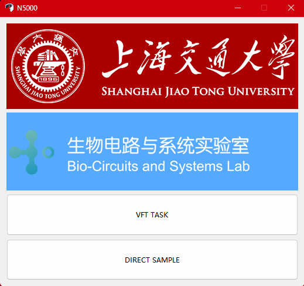
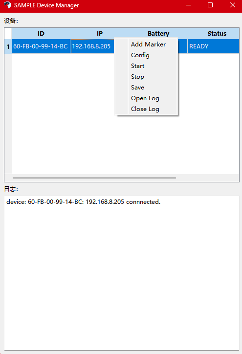
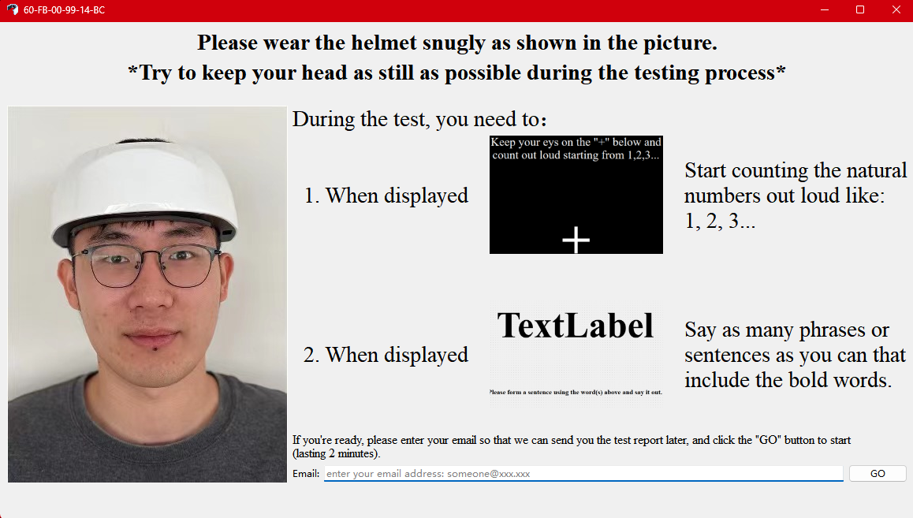
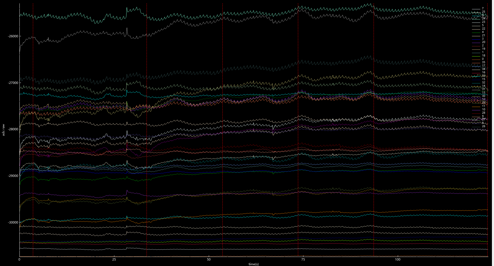

# N5000_SDK
## 🚀 INSTALL
- open qtcreator
- open [CMakelist.txt](Source/CMakeLists.txt) file in qtcreator
- configure project with qt-6.5.2-mingw-64-bit build kits
- build and run
- connect your computer to brain-helmet-wifi-domain and set your IPV4 address to 192.168.8.121
- start BRAIN-N5000 (system starts up with the blue LED flash)
- connect BRAIN-N5000 with this software you build (or with our [release version](Release.zip))

## 📸 Snapshot
### Main Menu 

---
### Device Manager

---
### pre-defined Task

---
### wave display
